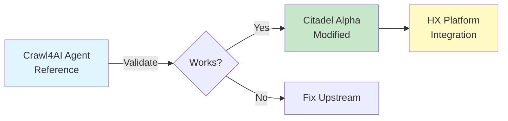
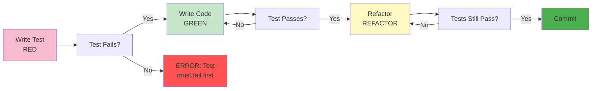

# CLAUDE.md

This file provides guidance to Claude Code (claude.ai/code) when working with code in this repository.

## Overview

**HX-Citadel-Alpha** is an advanced RAG (Retrieval-Augmented Generation) system adapted from Crawl4AI and optimized for the **HX-Deployment and Test Platform** infrastructure operated by Hana-X AI.

**Current Status** (October 15, 2025):
- **Phase**: Repository initialization
- **Progress**: Directory structure created, core documentation in place
- **Next Steps**: Container scaffolding, Ansible integration, spec framework

## Essential Commands

### Development Workflow

```bash
# Setup development environment
cd /projects/HX-Citadel-Alpha
python -m venv venv
source venv/bin/activate  # On Windows: venv\Scripts\activate
pip install -r requirements.txt

# Run tests
pytest tests/ -v --cov

# Build containers
cd containers/crawl4ai-agent && docker-compose build
cd containers/citadel-alpha && docker-compose build

# Deploy to test server (requires Ansible)
ansible-playbook -i ansible/inventory/test-server.ini ansible/playbooks/install-docker.yml
ansible-playbook -i ansible/inventory/test-server.ini ansible/playbooks/deploy-citadel-alpha.yml

# Health checks
curl http://hx-test-server:11235/health  # Crawl4AI Agent
curl http://hx-test-server:11236/health  # Citadel Alpha
```

### Code Quality

```bash
# Format code
black src/ tests/ --line-length 100
isort src/ tests/

# Lint
flake8 src/ tests/
mypy src/

# Security scan
trivy image citadel-alpha:latest
```

---

## Project Architecture

### Two-Container Strategy



**Key Principle**: We maintain BOTH containers:
1. **Crawl4AI Agent** - Original from ottomator-agents (baseline/validation)
2. **Citadel Alpha** - Our modified version with HX Platform integration

This allows us to:
- Validate our changes against the original
- Track upstream updates
- Isolate integration issues
- Document our modifications

### HX Platform Integration

**Service Dependencies**:

| Service | Endpoint | Purpose | Container |
|---------|----------|---------|-----------|
| Ollama (Embeddings) | `hx-orchestrator-server:11434` | Low-latency embeddings | Citadel Alpha only |
| Ollama (LLMs) | `hx-ollama1:11434` | Text generation | Citadel Alpha only |
| Qdrant | `hx-vectordb-server:6333` | Vector storage/search | Citadel Alpha only |
| Redis | `hx-sqldb-server:6379` | Task queue + cache | Citadel Alpha only |
| Open WebUI | `hx-webui-server:8080` | User interface | Citadel Alpha only |

**Connection Pattern**:
```python
# containers/citadel-alpha/src/config/hx_platform.py
from dataclasses import dataclass

@dataclass
class HXPlatformConfig:
    """Configuration for HX Platform service connections"""

    # Ollama endpoints
    ollama_embeddings_url: str = "http://hx-orchestrator-server:11434"
    ollama_llm_url: str = "http://hx-ollama1:11434"

    # Data services
    qdrant_url: str = "https://hx-vectordb-server:6333"
    qdrant_api_key: str = "REDACTED"  # From environment
    redis_url: str = "redis://hx-sqldb-server:6379"

    # UI
    openwebui_url: str = "http://hx-webui-server:8080"
```

---

## Development Standards

### MANDATORY: TDD Workflow

**Test-Driven Development is NON-NEGOTIABLE**. Follow this exact sequence:



**Example**:
```bash
# 1. Write test (RED)
cat > tests/citadel-alpha/test_ollama_integration.py <<EOF
def test_ollama_embeddings_connection():
    """Verify connection to Ollama embeddings service"""
    from src.config.ollama import get_embedding

    result = get_embedding("test query")
    assert result is not None
    assert len(result) == 1024  # mxbai-embed-large dimension
EOF

# 2. Run test - MUST FAIL
pytest tests/citadel-alpha/test_ollama_integration.py
# Expected: FAILED (module not found)

# 3. Write implementation (GREEN)
# ... implement src/config/ollama.py ...

# 4. Test passes
pytest tests/citadel-alpha/test_ollama_integration.py
# Expected: PASSED

# 5. Refactor if needed, tests must still pass

# 6. Commit
git add .
git commit -m "feat(citadel-alpha): add Ollama embeddings connection"
```

### Spec-Driven Development

**NEVER start coding without a spec**. Follow this process:

1. **Create Spec** (`specs/###-feature-name/spec.md`)
   - Use template from `/projects/templates/spec-template.md`
   - Define WHAT and WHY (not HOW)
   - Get stakeholder approval

2. **Create Plan** (`specs/###-feature-name/plan.md`)
   - Use template from `/projects/templates/plan-template.md`
   - Research unknowns
   - Design data model and contracts
   - Document technical approach

3. **Generate Tasks** (`specs/###-feature-name/tasks.md`)
   - Use template from `/projects/templates/tasks-template.md`
   - Break plan into concrete, orderable tasks
   - Mark tasks that can run in parallel [P]

4. **Execute Tasks** (TDD workflow per task)

**Example Spec Structure**:
```
specs/002-citadel-alpha-integration/
├── spec.md           # Business requirements (WHAT/WHY)
├── plan.md           # Technical approach (HOW)
├── research.md       # Investigation findings
├── data-model.md     # Entity definitions
├── contracts/        # API contracts (OpenAPI)
│   ├── ollama.yaml
│   └── qdrant.yaml
├── quickstart.md     # User acceptance test
└── tasks.md          # Ordered implementation tasks
```

---

## Critical Files and Conventions

### Container Structure

```
containers/{crawl4ai-agent,citadel-alpha}/
├── Dockerfile              # Multi-stage build, security-hardened
├── docker-compose.yml      # Development + production configs
├── .env.example            # Template for secrets
├── requirements.txt        # Python dependencies (pinned versions)
├── src/
│   ├── __init__.py
│   ├── config/             # Configuration modules
│   │   ├── ollama.py
│   │   ├── qdrant.py
│   │   └── hx_platform.py
│   ├── models/             # Data models
│   ├── services/           # Business logic
│   └── utils/              # Utilities
└── tests/
    ├── conftest.py         # Pytest fixtures
    ├── test_config.py
    └── test_integration.py
```

### Ansible Structure

```
ansible/
├── inventory/
│   └── test-server.ini     # hx-test-server (192.168.10.13)
├── playbooks/
│   ├── install-docker.yml          # Docker installation
│   ├── deploy-crawl4ai.yml         # Original container
│   └── deploy-citadel-alpha.yml    # Modified container
├── roles/
│   └── docker/                     # Docker role (from hx-citadel-ansible)
│       ├── tasks/
│       │   ├── main.yml
│       │   ├── install.yml
│       │   └── containers.yml
│       ├── defaults/
│       │   └── main.yml
│       └── handlers/
│           └── main.yml
└── group_vars/
    └── all.yml             # Global variables
```

---

## Common Patterns

### Health Check Pattern

```python
# src/health.py
from fastapi import FastAPI, status
from fastapi.responses import JSONResponse

app = FastAPI()

@app.get("/health", status_code=status.HTTP_200_OK)
async def health_check():
    """Basic liveness check"""
    return {"status": "healthy"}

@app.get("/ready", status_code=status.HTTP_200_OK)
async def readiness_check():
    """Readiness check - verify dependencies"""
    checks = {
        "ollama": await check_ollama_connection(),
        "qdrant": await check_qdrant_connection(),
        "redis": await check_redis_connection()
    }

    if all(checks.values()):
        return {"status": "ready", "checks": checks}
    else:
        return JSONResponse(
            status_code=status.HTTP_503_SERVICE_UNAVAILABLE,
            content={"status": "not_ready", "checks": checks}
        )
```

### Configuration Pattern

```python
# src/config/base.py
import os
from pydantic import BaseSettings

class Settings(BaseSettings):
    """Application settings with environment variable support"""

    # HX Platform services
    ollama_embeddings_url: str = os.getenv("OLLAMA_EMBEDDINGS_URL", "http://hx-orchestrator-server:11434")
    ollama_llm_url: str = os.getenv("OLLAMA_LLM_URL", "http://hx-ollama1:11434")
    qdrant_url: str = os.getenv("QDRANT_URL", "https://hx-vectordb-server:6333")
    qdrant_api_key: str = os.getenv("QDRANT_API_KEY", "")
    redis_url: str = os.getenv("REDIS_URL", "redis://hx-sqldb-server:6379")

    # Application
    log_level: str = os.getenv("LOG_LEVEL", "INFO")
    debug: bool = os.getenv("DEBUG", "false").lower() == "true"

    class Config:
        env_file = ".env"
        case_sensitive = False

settings = Settings()
```

### Error Handling Pattern

```python
# src/utils/errors.py
import logging
from typing import Optional

logger = logging.getLogger(__name__)

class HXPlatformError(Exception):
    """Base exception for HX Platform integration errors"""

    def __init__(self, service: str, message: str, details: Optional[dict] = None):
        self.service = service
        self.message = message
        self.details = details or {}
        super().__init__(f"{service} error: {message}")

        logger.error(
            f"HX Platform Error",
            extra={
                "service": service,
                "message": message,
                "details": details
            }
        )

class OllamaConnectionError(HXPlatformError):
    """Ollama service connection error"""
    def __init__(self, message: str, details: Optional[dict] = None):
        super().__init__("Ollama", message, details)

class QdrantConnectionError(HXPlatformError):
    """Qdrant service connection error"""
    def __init__(self, message: str, details: Optional[dict] = None):
        super().__init__("Qdrant", message, details)
```

---

## Testing Strategies

### Unit Tests

**Location**: `tests/{crawl4ai,citadel-alpha}/`

**Pattern**:
```python
# tests/citadel-alpha/test_ollama.py
import pytest
from src.config.ollama import OllamaClient

@pytest.fixture
def ollama_client():
    """Create test Ollama client"""
    return OllamaClient(url="http://localhost:11434")

def test_embedding_generation(ollama_client):
    """Test embedding generation"""
    result = ollama_client.get_embedding("test query")
    assert result is not None
    assert len(result) == 1024  # mxbai-embed-large dimension
    assert all(isinstance(x, float) for x in result)

@pytest.mark.integration
def test_ollama_health(ollama_client):
    """Test Ollama service health"""
    assert ollama_client.health_check() is True
```

### Integration Tests

**Pattern**:
```python
# tests/citadel-alpha/test_hx_platform_integration.py
import pytest
from src.config.hx_platform import HXPlatformConfig

@pytest.mark.integration
class TestHXPlatformIntegration:
    """Integration tests for HX Platform services"""

    def test_ollama_embeddings_connection(self):
        """Verify Ollama embeddings service is reachable"""
        config = HXPlatformConfig()
        # Test implementation

    def test_qdrant_connection(self):
        """Verify Qdrant vector DB is reachable"""
        config = HXPlatformConfig()
        # Test implementation

    def test_redis_connection(self):
        """Verify Redis is reachable"""
        config = HXPlatformConfig()
        # Test implementation
```

---

## Deployment Workflow

### Manual Deployment (Development)

```bash
# 1. Build image
cd containers/citadel-alpha
docker-compose build

# 2. Run locally
docker-compose up -d

# 3. Verify health
curl http://localhost:11236/health
curl http://localhost:11236/ready

# 4. View logs
docker-compose logs -f
```

### Ansible Deployment (Test Server)

```bash
# 1. Verify connectivity
ansible hx-test-server -i ansible/inventory/test-server.ini -m ping

# 2. Install Docker (if needed)
ansible-playbook -i ansible/inventory/test-server.ini ansible/playbooks/install-docker.yml

# 3. Deploy container
ansible-playbook -i ansible/inventory/test-server.ini ansible/playbooks/deploy-citadel-alpha.yml

# 4. Verify deployment
ansible hx-test-server -i ansible/inventory/test-server.ini -m shell -a "docker ps | grep citadel-alpha"
```

---

## Troubleshooting

### Common Issues

| Issue | Cause | Solution |
|-------|-------|----------|
| **Ollama timeout** | Service not reachable | Verify network, check firewall |
| **Qdrant auth failure** | Invalid API key | Check `QDRANT_API_KEY` env var |
| **Docker build fails** | Missing dependencies | Review `requirements.txt`, check base image |
| **Tests fail in CI** | Environment differences | Use docker-compose.test.yml |

### Debug Commands

```bash
# Check container logs
docker logs citadel-alpha

# Exec into container
docker exec -it citadel-alpha /bin/bash

# Test HX Platform connectivity
docker exec citadel-alpha curl http://hx-orchestrator-server:11434/api/version

# Check environment variables
docker exec citadel-alpha env | grep HX

# Restart container
docker-compose restart citadel-alpha
```

---

## Reference Documents

**Templates**:
- `/projects/templates/spec-template.md` - Feature specification template
- `/projects/templates/plan-template.md` - Implementation plan template
- `/projects/templates/tasks-template.md` - Task list template
- `/projects/templates/constitution.md` - Constitution template

**HX Platform**:
- `/home/agent0/workspace/hx-citadel-ansible/` - Platform Ansible configuration
- `/home/agent0/workspace/hx-citadel-ansible/docs/ANSIBLE-BEST-PRACTICES.md` - Ansible standards
- `/home/agent0/workspace/hx-citadel-ansible/docs/Delivery-Enhancements/HX-ARCHITECTURE.md` - Platform architecture

**Crawl4AI Source**:
- `/home/agent0/workspace/hx-citadel-ansible/tech_kb/ottomator-agents-main/crawl4AI-agent-v2/` - Original source

---

## Current Implementation Status

### Phase Progress
- **Phase 1: Repository Initialization** ✅ IN PROGRESS
  - [x] Directory structure created
  - [x] Core documentation (README, CONSTITUTION, CLAUDE.md)
  - [ ] .gitignore and .dockerignore
  - [ ] Ansible integration
  - [ ] Container scaffolding
  - [ ] Spec framework
  - [ ] Initial commit

- **Phase 2: Crawl4AI Validation** ⏭️ PENDING
- **Phase 3: Citadel Alpha Integration** ⏭️ PENDING
- **Phase 4: Production Deployment** ⏭️ PENDING

### Next Steps
1. Complete repository initialization
2. Create spec for Crawl4AI validation
3. Deploy original container to test server
4. Create spec for Citadel Alpha integration
5. Implement HX Platform modifications

---

**Last Updated**: 2025-10-15
**Current Branch**: `main`
**Project Status**: Repository Initialization
**Company**: Hana-X AI
**Platform**: HX-Deployment and Test Platform

---

*This file is automatically updated as the project evolves. Keep it under 200 lines for token efficiency.*
