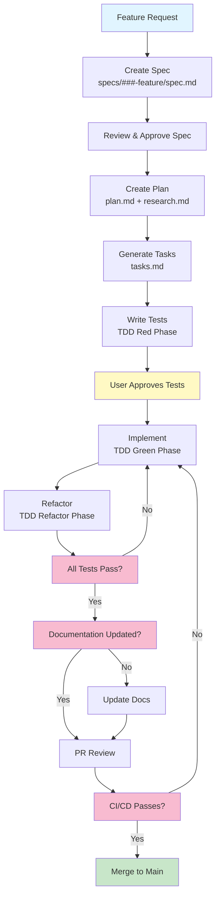
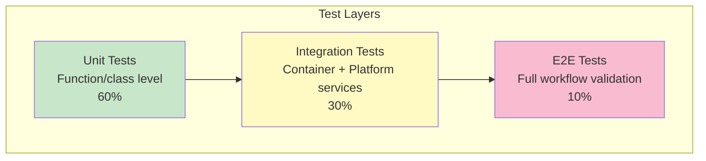
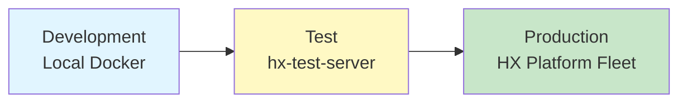

# HX-Citadel-Alpha Constitution

## Core Principles

### I. Container-First Development
Every feature must be container-compatible and infrastructure-agnostic. Containers must be:
- Self-contained with all dependencies
- Independently testable
- Clearly documented (README + docker-compose.yml)
- Production-ready from day one

**Rationale**: Ensures consistent behavior across development, testing, and production environments.

### II. HX Platform Integration
All components must integrate cleanly with the HX-Deployment and Test Platform:
- Use platform services (Ollama, Qdrant, Redis, Open WebUI)
- Follow platform naming conventions (hx-* hostnames)
- Respect platform architecture patterns
- Document all integration points

**Rationale**: Leverages existing infrastructure, reduces operational complexity, maintains platform consistency.

### III. Test-First Development (NON-NEGOTIABLE)
TDD is mandatory for all code changes:
- Tests written BEFORE implementation
- User/stakeholder approval of tests BEFORE coding
- Tests must fail initially (Red phase)
- Implementation makes tests pass (Green phase)
- Refactor for quality (Refactor phase)

**Rationale**: Ensures code meets requirements, prevents regressions, serves as living documentation.

### IV. Spec-Driven Development
All features start with a specification:
- Feature spec created first (`specs/###-feature-name/spec.md`)
- Business requirements clearly documented
- Technical approach planned (`plan.md`)
- Tasks defined before implementation (`tasks.md`)

**Rationale**: Ensures clarity of purpose, prevents scope creep, enables parallel work streams.

### V. Two-Container Strategy
Maintain both original and modified versions:
- **Crawl4AI Agent**: Original reference implementation (validation)
- **Citadel Alpha**: Modified production version (HX Platform integration)

**Rationale**: Provides regression testing baseline, enables comparison, documents evolution.

### VI. Ansible-Based Deployment
All infrastructure changes use Ansible:
- Declarative configuration (idempotent)
- Version-controlled playbooks
- Follows ANSIBLE-BEST-PRACTICES.md
- Uses FQCN (Fully Qualified Collection Names)

**Rationale**: Repeatability, auditability, infrastructure-as-code best practices.

### VII. Documentation as Code
Documentation is first-class:
- Markdown-based (easy to version)
- Diagrams use Mermaid (text-based, version-friendly)
- Co-located with code (in `docs/`)
- Updated with each PR

**Rationale**: Prevents documentation drift, enables review process, ensures accuracy.

---

## Development Workflow

### Feature Development Process



### Branch Strategy

| Branch Type | Pattern | Purpose | Example |
|-------------|---------|---------|---------|
| **Main** | `main` | Production-ready code | `main` |
| **Feature** | `feature/###-name` | New features | `feature/001-ollama-integration` |
| **Bugfix** | `bugfix/###-name` | Bug fixes | `bugfix/002-qdrant-timeout` |
| **Hotfix** | `hotfix/###-name` | Emergency fixes | `hotfix/003-memory-leak` |

### Commit Message Format

```
<type>(scope): <subject>

<body>

<footer>
```

**Types**: feat, fix, docs, style, refactor, test, chore

**Example**:
```
feat(citadel-alpha): integrate Ollama embeddings

- Configure connection to hx-orchestrator-server:11434
- Replace OpenAI embedding calls with Ollama
- Add health check for Ollama service

Closes #001
```

---

## Testing Requirements

### Test Pyramid



### Test Coverage Requirements

| Component | Unit Coverage | Integration Coverage | E2E Coverage |
|-----------|--------------|---------------------|--------------|
| **Core Logic** | ≥80% | ≥60% | ≥1 happy path |
| **API Endpoints** | ≥70% | 100% | ≥1 per endpoint |
| **HX Platform Integration** | N/A | 100% | ≥1 per service |
| **Container Health** | N/A | 100% | 100% |

### Test Execution

**Before Commit**:
```bash
# Run unit tests
pytest tests/ -v --cov

# Run integration tests (requires Docker)
docker-compose -f docker-compose.test.yml up --abort-on-container-exit
```

**CI/CD Pipeline**:
- Unit tests on every PR
- Integration tests on every PR
- E2E tests on merge to main

---

## Code Quality Standards

### Python (Primary Language)

**Style**:
- PEP 8 compliant
- Black formatter (line length: 100)
- isort for import organization
- Type hints required for all functions

**Linting**:
```bash
# Required to pass
black --check .
isort --check .
flake8 .
mypy src/
```

### Docker

**Dockerfile Best Practices**:
- Multi-stage builds
- Layer caching optimization
- Security scanning (trivy)
- Non-root user execution
- Health checks included

### Ansible

**Playbook Standards**:
- FQCN mandatory (`ansible.builtin.*`)
- Idempotent tasks only
- No `shell`/`command` without `changed_when`
- Secrets via Ansible Vault
- Error handling with `block`/`rescue`/`always`

**Reference**: Follow `/home/agent0/workspace/hx-citadel-ansible/docs/ANSIBLE-BEST-PRACTICES.md`

---

## Security Requirements

### Secrets Management

❌ **NEVER**:
- Commit secrets to Git
- Use hardcoded API keys
- Expose credentials in logs
- Include `.env` files in Docker images

✅ **ALWAYS**:
- Use `.env.example` templates
- Secrets via Ansible Vault
- Environment variables at runtime
- Rotate credentials regularly

### Container Security

**Requirements**:
- Non-root execution
- Read-only root filesystem where possible
- Security scanning before deployment
- Minimal base images (Alpine preferred)
- No unnecessary capabilities

### Network Security

**HX Platform Access**:
- Internal network only (no external exposure)
- Service-to-service TLS where possible
- Firewall rules documented
- Port exposure minimized

---

## Deployment Standards

### Environment Progression



### Deployment Checklist

**Pre-Deployment**:
- [ ] All tests passing (unit + integration + E2E)
- [ ] Documentation updated
- [ ] CHANGELOG.md entry added
- [ ] Version bumped (semantic versioning)
- [ ] Security scan passed
- [ ] Ansible playbook tested (--check mode)

**Deployment**:
- [ ] Ansible playbook execution logged
- [ ] Health checks pass
- [ ] Monitoring alerts configured
- [ ] Rollback plan documented

**Post-Deployment**:
- [ ] Smoke tests executed
- [ ] Performance validated
- [ ] Logs reviewed for errors
- [ ] Team notified

---

## Performance Requirements

### Latency Targets

| Operation | P50 | P95 | P99 |
|-----------|-----|-----|-----|
| **Document Crawl** | <5s | <10s | <20s |
| **Embedding Generation** | <100ms | <500ms | <1s |
| **Vector Search** | <200ms | <500ms | <1s |
| **Full RAG Query** | <2s | <5s | <10s |

### Resource Limits

| Container | CPU | Memory | Storage |
|-----------|-----|--------|---------|
| **Crawl4AI Agent** | 2 cores | 4GB | 10GB |
| **Citadel Alpha** | 4 cores | 8GB | 20GB |

---

## Observability Requirements

### Logging

**Structured Logging Required**:
```python
import logging
import json

logger.info(json.dumps({
    "event": "document_processed",
    "document_id": doc_id,
    "chunks": chunk_count,
    "duration_ms": duration,
    "timestamp": timestamp
}))
```

### Metrics

**Required Metrics**:
- Request rate (requests/second)
- Error rate (errors/total requests)
- Latency (P50, P95, P99)
- Resource utilization (CPU, memory, disk)

**Export Format**: Prometheus-compatible

### Health Checks

**Required Endpoints**:
- `/health` - Basic liveness check
- `/ready` - Readiness for traffic
- `/metrics` - Prometheus metrics

---

## Complexity Governance

### When Complexity is Justified

| Complexity | Justification Required | Approval |
|------------|----------------------|----------|
| **New external dependency** | Cost/benefit analysis | Team review |
| **Architectural change** | Design doc + ADR | Tech lead |
| **Breaking API change** | Migration plan | Product owner |
| **Performance optimization** | Benchmark proof | Tech lead |

### Simplicity First

**Question every addition**:
1. Can we solve this without new code?
2. Can we use existing HX Platform services?
3. Can we simplify the requirement?
4. What's the maintenance burden?

**YAGNI Principle**: "You Aren't Gonna Need It" - don't build for hypothetical futures.

---

## Governance

### Constitution Authority

This constitution supersedes all other development practices. All code changes, reviews, and deployments must comply.

### Amendments

**Process**:
1. Propose change via PR to `CONSTITUTION.md`
2. Include rationale and impact analysis
3. Team discussion (minimum 3 business days)
4. Approval requires consensus
5. Migration plan required for breaking changes

### Violations

**Handling**:
1. Violations documented in PR review
2. Must be fixed before merge
3. Repeat violations escalated to team lead
4. Emergency violations require post-hoc justification

### Version History

**Version**: 1.0.0
**Ratified**: 2025-10-15
**Last Amended**: 2025-10-15
**Next Review**: 2026-01-15 (quarterly review cycle)

---

**WE BUILD WITH DISCIPLINE, DEPLOY WITH CONFIDENCE** 🚀

*HX-Citadel-Alpha Constitution - Hana-X AI*
