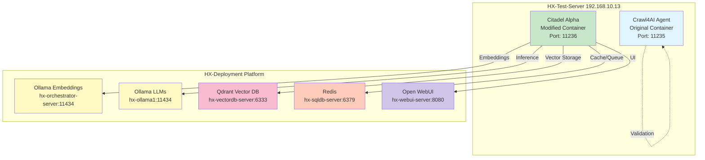

# HX-Citadel-Alpha

**Advanced RAG Agent with Knowledge Graph Integration**

[](LICENSE)
[](https://hana-x.ai)
[](https://github.com/hanax-ai/HX-Citadel-Alpha)

---

## Overview

**HX-Citadel-Alpha** is an intelligent documentation crawler and retrieval-augmented generation (RAG) system, adapted from Crawl4AI and optimized for the **HX-Deployment and Test Platform** infrastructure.

### Key Features

- **🔍 Intelligent Crawling**: Advanced web crawling with Crawl4AI and Playwright
- **🤖 Local LLM Integration**: Uses Ollama for embeddings and inference (no external API dependencies)
- **📊 Vector Database**: Qdrant integration for semantic search
- **🌐 Modern UI**: Open WebUI interface (replacing Streamlit)
- **🧠 Knowledge Graph**: LightRAG-powered entity extraction and relationship mapping
- **🐳 Containerized**: Docker-based deployment for consistency and scalability

---

## Architecture

### Two-Container Strategy



### Container Breakdown

| Container | Purpose | Base | Modifications |
|-----------|---------|------|---------------|
| **Crawl4AI Agent** | Original validation | `ottomator-agents/crawl4AI-agent-v2` | None (reference implementation) |
| **Citadel Alpha** | Production RAG system | Modified clone | Ollama + Qdrant + Open WebUI |

---

## Quick Start

### Prerequisites

- Docker 24.0+
- Docker Compose V2
- Access to HX-Deployment and Test Platform
- Git

### Installation

```bash
# Clone repository
git clone https://github.com/hanax-ai/HX-Citadel-Alpha.git
cd HX-Citadel-Alpha

# Deploy Crawl4AI Agent (validation)
cd containers/crawl4ai-agent
docker-compose up -d

# Deploy Citadel Alpha (production)
cd ../citadel-alpha
docker-compose up -d
```

### Verification

```bash
# Check Crawl4AI Agent
curl http://hx-test-server:11235/health

# Check Citadel Alpha
curl http://hx-test-server:11236/health
```

---

## Project Structure

```
HX-Citadel-Alpha/
├── containers/
│   ├── crawl4ai-agent/     # Original Crawl4AI container
│   └── citadel-alpha/      # Modified container (Ollama/Qdrant/OpenWebUI)
├── ansible/                # Deployment automation
├── docs/                   # Architecture and operations documentation
├── specs/                  # Feature specifications
├── tests/                  # Test suites
├── scripts/                # Build and deployment scripts
└── config/                 # HX Platform integration configs
```

**See [Project Structure](docs/architecture/project-structure.md) for detailed breakdown.**

---

## Documentation

### Architecture
- [HX Platform Integration](docs/architecture/hx-platform-integration.md)
- [Container Strategy](docs/architecture/container-strategy.md)
- [Data Flow](docs/architecture/data-flow.md)

### Deployment
- [Docker Installation](docs/deployment/docker-installation.md)
- [Crawl4AI Deployment](docs/deployment/crawl4ai-deployment.md)
- [Citadel Alpha Deployment](docs/deployment/citadel-alpha-deployment.md)

### Operations
- [Monitoring](docs/operations/monitoring.md)
- [Troubleshooting](docs/operations/troubleshooting.md)

---

## Development

### Governance

This project follows the **HX-Citadel-Alpha Constitution** (see [CONSTITUTION.md](CONSTITUTION.md)) for:
- Development workflow
- Testing requirements
- Code quality standards
- Deployment practices

### AI Agent Guidance

See [CLAUDE.md](CLAUDE.md) for AI-specific development guidance and project context.

### Contributing

1. Read [CONSTITUTION.md](CONSTITUTION.md)
2. Create feature branch: `git checkout -b feature/001-feature-name`
3. Follow spec-driven development (see `specs/` directory)
4. Write tests first (TDD required)
5. Submit PR with tests passing

---

## Technology Stack

| Component | Technology | Version | Purpose |
|-----------|-----------|---------|---------|
| **Web Crawling** | Crawl4AI + Playwright | 0.6.2 | Document ingestion |
| **Embeddings** | Ollama (mxbai-embed-large) | Latest | Semantic embeddings |
| **LLM** | Ollama (gemma3, mistral) | Latest | Text generation |
| **Vector DB** | Qdrant | 1.x | Semantic search |
| **Cache/Queue** | Redis | 7.x | Job queue and caching |
| **Frontend** | Open WebUI | Latest | User interface |
| **Orchestration** | Docker Compose | V2 | Container management |
| **Deployment** | Ansible | 2.20 | Infrastructure automation |

---

## Integration with HX Platform

### Service Endpoints

| Service | Endpoint | Purpose |
|---------|----------|---------|
| Ollama Embeddings | `hx-orchestrator-server:11434` | Low-latency embeddings |
| Ollama LLMs | `hx-ollama1:11434` | Text generation |
| Qdrant | `hx-vectordb-server:6333` | Vector storage/search |
| Redis | `hx-sqldb-server:6379` | Task queue |
| Open WebUI | `hx-webui-server:8080` | User interface |

**See [HX Platform Integration](docs/architecture/hx-platform-integration.md) for detailed configuration.**

---

## Roadmap

### Phase 1: Foundation ✅
- [x] Repository structure
- [x] Base documentation
- [x] Docker role setup

### Phase 2: Crawl4AI Validation
- [ ] Deploy original container
- [ ] Validate basic functionality
- [ ] Document limitations

### Phase 3: Citadel Alpha Integration
- [ ] Modify for Ollama integration
- [ ] Replace ChromaDB with Qdrant
- [ ] Implement Open WebUI adapter
- [ ] Integration testing

### Phase 4: Production Deployment
- [ ] Deploy to test server
- [ ] Performance optimization
- [ ] Monitoring setup
- [ ] Documentation finalization

---

## License

MIT License - see [LICENSE](LICENSE) for details

---

## Contact

**Hana-X AI**
- Website: [hana-x.ai](https://hana-x.ai)
- GitHub: [@hanax-ai](https://github.com/hanax-ai)
- Email: jarvisr@hana-x.ai

**Project**: HX-Citadel-Alpha
**Platform**: HX-Deployment and Test Platform
**Maintained by**: Hana-X AI Team

---

*Built with ❤️ by Hana-X AI*
