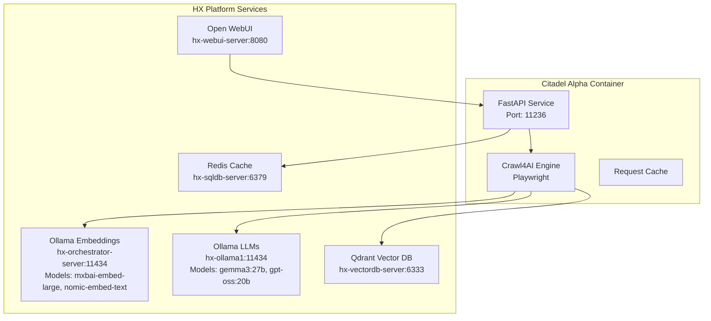

# Citadel Alpha (HX Platform Integration)

**Production-ready Crawl4AI Agent modified for HX-Deployment and Test Platform**

This container is a **modified version** of the original Crawl4AI Agent, adapted to leverage HX Platform services instead of external APIs.

## Purpose

- Production deployment of web crawling agent
- Integration with HX Platform infrastructure
- API-first design for Open WebUI integration
- Validation against original implementation

## Architecture Integration



## Key Modifications from Original

| Component | Original | Citadel Alpha |
|-----------|----------|---------------|
| **LLM** | OpenAI API (external) | Ollama (hx-ollama1:11434) |
| **Embeddings** | OpenAI API | Ollama (hx-orchestrator-server:11434) |
| **Vector DB** | ChromaDB (embedded) | Qdrant (hx-vectordb-server:6333) |
| **Cache** | None | Redis (hx-sqldb-server:6379) |
| **UI** | Streamlit (built-in) | Open WebUI integration (API-first) |
| **Port** | 11235 | 11236 |
| **Purpose** | Reference/Validation | Production |

## Configuration

### Port
- **External**: 11236
- **Internal**: 11236

### HX Platform Dependencies
- **Ollama Embeddings**: hx-orchestrator-server:11434
  - Models: mxbai-embed-large, nomic-embed-text, all-minilm
- **Ollama LLMs**: hx-ollama1:11434
  - Models: gemma3:27b, gpt-oss:20b, mistral:7b
- **Qdrant**: hx-vectordb-server:6333
- **Redis**: hx-sqldb-server:6379
- **Open WebUI**: hx-webui-server:8080 (frontend)

### Environment Variables

See `.env.example` for required configuration.

## Deployment

### Local Development

```bash
cd containers/citadel-alpha

# Copy environment template
cp .env.example .env

# Edit .env with HX Platform endpoints
nano .env

# Build and run
docker-compose up --build
```

### Test Server Deployment

```bash
# Via Ansible
ansible-playbook -i ansible/inventory/test-server.ini ansible/playbooks/deploy-citadel-alpha.yml

# Verify HX Platform connectivity
curl http://hx-test-server:11236/health

# Check service integrations
curl http://hx-test-server:11236/health/integrations
```

## API Endpoints

### Health & Status
- `GET /health` - Container health check
- `GET /health/integrations` - HX Platform service status

### Crawling
- `POST /api/crawl` - Submit crawl job
- `GET /api/crawl/{job_id}` - Get crawl status/results
- `GET /api/crawl/{job_id}/embeddings` - Get vector embeddings

### Collections (Qdrant)
- `GET /api/collections` - List vector collections
- `POST /api/collections` - Create new collection
- `DELETE /api/collections/{name}` - Delete collection

## Open WebUI Integration

Citadel Alpha exposes an OpenAI-compatible API that Open WebUI can consume:

```bash
# Configure in Open WebUI
# Settings > Connections > OpenAI API
# Base URL: http://hx-test-server:11236/v1
# API Key: (set in .env as HX_API_KEY)
```

## Development Guidelines

### Adding New Features
1. Create spec in `/specs/`
2. Update HX Platform integration contracts
3. Write tests (TDD required)
4. Implement with platform services
5. Update API documentation

### Testing HX Platform Integration
```bash
# Test Ollama embeddings
curl http://hx-orchestrator-server:11434/api/embeddings \
  -d '{"model": "mxbai-embed-large", "prompt": "test"}'

# Test Ollama LLM
curl http://hx-ollama1:11434/api/generate \
  -d '{"model": "gemma3:27b", "prompt": "test"}'

# Test Qdrant
curl https://hx-vectordb-server:6333/collections

# Test Redis
redis-cli -h hx-sqldb-server -p 6379 ping
```

## Source Code Structure

```
src/
├── config/
│   ├── hx_platform.py      # HX Platform service configuration
│   ├── ollama.py           # Ollama client configuration
│   └── qdrant.py           # Qdrant client configuration
├── services/
│   ├── crawl_service.py    # Core crawling logic
│   ├── embedding_service.py # Ollama embeddings integration
│   ├── llm_service.py      # Ollama LLM integration
│   └── vector_service.py   # Qdrant vector operations
├── api/
│   ├── main.py             # FastAPI application
│   ├── routes/             # API route handlers
│   └── models/             # Pydantic models
└── utils/
    ├── cache.py            # Redis caching
    └── monitoring.py       # Health checks

```

## Monitoring

```bash
# Container logs
docker logs -f citadel-alpha

# Health check
watch -n 5 'curl -s http://hx-test-server:11236/health | jq'

# Integration status
curl http://hx-test-server:11236/health/integrations | jq
```

## Troubleshooting

### Cannot connect to Ollama
```bash
# Verify Ollama services are running
curl http://hx-orchestrator-server:11434/api/version
curl http://hx-ollama1:11434/api/version

# Check network connectivity from container
docker exec citadel-alpha ping hx-orchestrator-server
```

### Cannot connect to Qdrant
```bash
# Verify Qdrant is accessible
curl https://hx-vectordb-server:6333/collections

# Check SSL/TLS configuration
openssl s_client -connect hx-vectordb-server:6333
```

### Redis connection issues
```bash
# Test Redis connectivity
redis-cli -h hx-sqldb-server -p 6379 ping

# Check from container
docker exec citadel-alpha redis-cli -h hx-sqldb-server -p 6379 ping
```

## References

- [HX Platform Architecture](/docs/HX-ARCHITECTURE.md)
- [Original Crawl4AI Agent](../crawl4ai-agent/README.md)
- [Crawl4AI Documentation](https://github.com/unclecode/crawl4ai)
- [Ollama API](https://github.com/ollama/ollama/blob/main/docs/api.md)
- [Qdrant Documentation](https://qdrant.tech/documentation/)
