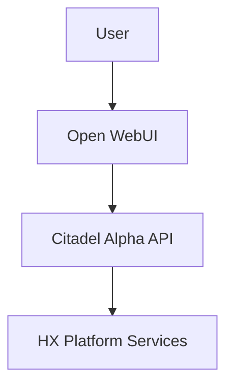

# HX-Citadel-Alpha Documentation

This directory contains additional project documentation beyond the main repository files.

## Document Organization

### Root-Level Documentation

Located at the repository root:

- **README.md** - Project overview, architecture, quick start
- **CONSTITUTION.md** - Development governance, TDD workflow, coding standards
- **CLAUDE.md** - AI agent guidance for Claude Code
- **.gitignore** / **.dockerignore** - File exclusion patterns

### Feature Specifications

Located in `specs/` directory:

```
specs/
├── 001-crawl4ai-validation/      # Original Crawl4AI Agent deployment
│   ├── spec.md                   # Feature specification
│   ├── plan.md                   # Implementation plan
│   ├── research.md               # Research findings
│   ├── tasks.md                  # Task breakdown (TDD workflow)
│   ├── contracts/                # API contracts (if applicable)
│   └── *.md                      # Additional feature docs
└── 002-citadel-alpha-integration/ # Citadel Alpha HX Platform integration
    ├── spec.md                   # Feature specification
    ├── plan.md                   # Implementation plan
    ├── research.md               # Research findings
    ├── tasks.md                  # Task breakdown (TDD workflow)
    ├── contracts/                # OpenAPI contracts
    │   ├── health.yaml
    │   ├── crawl.yaml
    │   ├── collections.yaml
    │   ├── query.yaml
    │   └── openai.yaml
    └── *.md                      # Additional feature docs
```

### Additional Documentation (This Directory)

Use this `docs/` directory for:

- **Architecture diagrams** - System design documents beyond README.md
- **API documentation** - Generated from OpenAPI specs or manual references
- **Deployment guides** - Environment-specific deployment instructions
- **Testing guides** - Comprehensive testing strategies and procedures
- **Troubleshooting** - Common issues and solutions
- **Change logs** - Version history and migration guides
- **Design decisions** - ADRs (Architecture Decision Records)

## Suggested Structure

As the project evolves, consider organizing this directory as:

```
docs/
├── README.md                    # This file
├── architecture/
│   ├── system-design.md
│   ├── data-flow.md
│   └── diagrams/
├── api/
│   ├── openapi.yaml             # Combined OpenAPI spec
│   ├── endpoints.md
│   └── authentication.md
├── deployment/
│   ├── test-server.md           # hx-test-server specific
│   ├── production.md
│   └── rollback-procedures.md
├── testing/
│   ├── test-strategy.md
│   ├── manual-test-procedures.md
│   └── performance-benchmarks.md
├── troubleshooting/
│   ├── common-issues.md
│   ├── hx-platform-integration.md
│   └── debugging-guide.md
└── adr/                         # Architecture Decision Records
    ├── 001-two-container-strategy.md
    ├── 002-ollama-vs-openai.md
    └── 003-fastapi-vs-streamlit.md
```

## Documentation Guidelines

### Spec-Driven Development

All features start with a specification in `specs/###-feature-name/`:

1. **spec.md** - What and why (user scenarios, requirements, acceptance criteria)
2. **plan.md** - How (technical approach, architecture, dependencies)
3. **research.md** - Investigation findings, technology comparisons
4. **contracts/** - API contracts (OpenAPI, GraphQL schemas)
5. **tasks.md** - TDD task breakdown (tests first, then implementation)

### Mermaid Diagrams

All diagrams should use Mermaid (text-based) for version control and maintainability:



### Markdown Standards

- Use GitHub-Flavored Markdown
- Include table of contents for documents >3 sections
- Use code blocks with language specifiers
- Link between related documents
- Keep lines under 120 characters for readability

### Version Control

- Commit documentation with related code changes
- Use conventional commits: `docs: Add deployment guide for test-server`
- Review documentation in pull requests
- Update CLAUDE.md when adding new patterns or conventions

## Contributing

When adding new documentation:

1. **Determine location**:
   - Feature-specific? → `specs/###-feature-name/`
   - General project? → Root level (README, CONSTITUTION, CLAUDE)
   - Additional reference? → This `docs/` directory

2. **Follow naming conventions**:
   - Lowercase with hyphens: `deployment-guide.md`
   - Descriptive names: `hx-platform-integration-troubleshooting.md`

3. **Link from README.md or CLAUDE.md** if the document is important for:
   - New contributors (README)
   - AI agents (CLAUDE.md)

4. **Update this README** if creating new subdirectories

## References

- **Hana-X AI Standards**: Follow organization-wide documentation practices
- **HX Platform Architecture**: `/home/agent0/workspace/hx-citadel-ansible/docs/Delivery-Enhancements/HX-ARCHITECTURE.md`
- **Template Examples**: `/projects/templates/` (spec, plan, tasks templates)

---

**Last Updated**: 2025-10-15
**Maintained By**: HX-Citadel-Alpha Team
