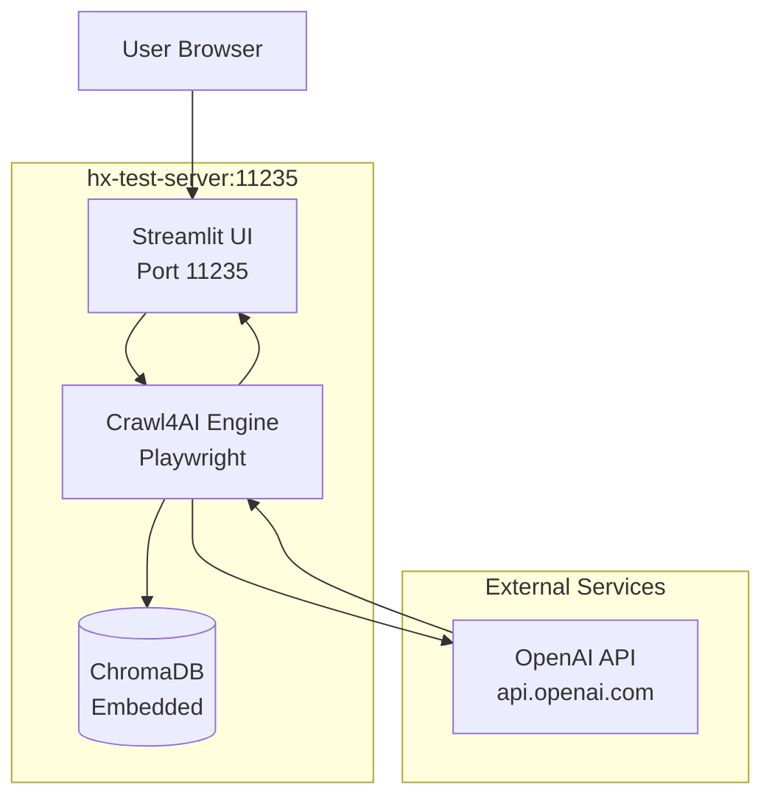

# Spec: Crawl4AI Agent Validation

**Feature ID**: 001-crawl4ai-validation
**Status**: Draft
**Created**: 2025-10-15
**Owner**: Hana-X AI Infrastructure Team

## Overview

Validate the original Crawl4AI Agent (from ottomator-agents/crawl4AI-agent-v2) deploys and operates correctly on hx-test-server. This establishes a baseline for regression testing and comparison against Citadel Alpha modifications.

## User Scenarios

### Scenario 1: Deploy Original Container
**As a** DevOps engineer
**I want to** deploy the unmodified Crawl4AI Agent container to hx-test-server
**So that** I can validate the reference implementation works correctly

**Acceptance Criteria**:
- [ ] Container builds successfully from Dockerfile
- [ ] Streamlit UI is accessible at http://hx-test-server:11235
- [ ] Health check endpoint returns 200 OK
- [ ] ChromaDB embedded database initializes
- [ ] OpenAI API connection can be configured via .env

### Scenario 2: Execute Web Crawling
**As a** user
**I want to** crawl a website using the Streamlit interface
**So that** I can validate crawling functionality works

**Acceptance Criteria**:
- [ ] Can submit URL via Streamlit UI
- [ ] Playwright browser launches successfully
- [ ] Web page content is extracted
- [ ] Results are displayed in UI
- [ ] ChromaDB stores vector embeddings

### Scenario 3: LLM Query Processing
**As a** user
**I want to** query crawled content using OpenAI LLM
**So that** I can validate RAG functionality works

**Acceptance Criteria**:
- [ ] Can submit natural language query
- [ ] Vector similarity search returns relevant chunks
- [ ] OpenAI API generates response
- [ ] Response includes source citations

## Requirements

### Functional Requirements

**FR-001**: Container Deployment
- Copy source code from `/home/agent0/workspace/hx-citadel-ansible/tech_kb/ottomator-agents-main/crawl4AI-agent-v2/`
- Build Docker image with Python 3.11, Playwright, and dependencies
- Deploy via Ansible to hx-test-server
- Expose port 11235 for Streamlit UI

**FR-002**: OpenAI Integration
- Accept OPENAI_API_KEY via environment variable
- Support model selection (gpt-4-turbo, gpt-4, gpt-3.5-turbo)
- Handle API errors gracefully

**FR-003**: ChromaDB Operations
- Initialize embedded ChromaDB on first run
- Persist data to volume mount at `./chroma_db`
- Support collection creation and deletion

**FR-004**: Health Monitoring
- Expose `/health` endpoint returning 200 when ready
- Include health check in docker-compose.yml
- Validate health check passes within 40s start period

### Non-Functional Requirements

**NFR-001**: Performance
- Crawl page load time < 30s for typical websites
- Embedding generation < 5s per page
- Query response time < 10s

**NFR-002**: Reliability
- Container restarts on failure (restart: unless-stopped)
- Health check retries 3x before marking unhealthy
- Graceful shutdown preserves ChromaDB data

**NFR-003**: Security
- OpenAI API key stored in .env (not committed to Git)
- No secrets exposed in logs or UI
- Playwright runs in sandboxed environment

### Technical Requirements

**TR-001**: Dependencies
- Python 3.11-slim base image
- crawl4ai==0.6.2
- playwright==1.52.0
- streamlit==1.45.0
- openai==1.76.2
- chromadb==1.0.7

**TR-002**: Ansible Deployment
- Playbook: `ansible/playbooks/deploy-crawl4ai.yml`
- Pre-flight checks: Docker installed, port 11235 available
- Health validation post-deployment
- Rollback on failure

## Architecture



## Data Model

### Environment Variables
```bash
# Required
OPENAI_API_KEY=sk-...

# Optional with defaults
MODEL_CHOICE=gpt-4-turbo
LOG_LEVEL=INFO
```

### ChromaDB Collections
```python
Collection(
    name="crawl_results",
    metadata={
        "url": "string",
        "crawled_at": "timestamp",
        "model": "string"
    },
    embeddings="openai/text-embedding-3-small"
)
```

## API Contracts

### Health Check
```http
GET /health
Response: 200 OK
{
  "status": "healthy",
  "chromadb": "connected",
  "playwright": "ready"
}
```

### Streamlit Interface
- **URL**: http://hx-test-server:11235
- **Authentication**: None (development only)
- **Features**: URL input, crawl button, results display, query interface

## Test Plan

### Unit Tests
- [ ] Playwright browser initialization
- [ ] ChromaDB connection and persistence
- [ ] OpenAI API client configuration

### Integration Tests
- [ ] End-to-end crawl workflow
- [ ] Vector storage and retrieval
- [ ] LLM query with RAG

### Deployment Tests
- [ ] Ansible playbook idempotency (run twice, no changes on second run)
- [ ] Container restart recovery
- [ ] Volume persistence across restarts

### Validation Tests (Manual)
1. Deploy container via Ansible
2. Access Streamlit UI at http://hx-test-server:11235
3. Crawl test URL: https://example.com
4. Verify content extracted and stored
5. Query: "What is the main purpose of this website?"
6. Verify response includes citations

## Success Metrics

- **Deployment Success Rate**: 100% on clean hx-test-server
- **Crawl Success Rate**: >95% for common websites
- **Query Response Accuracy**: Validated manually against source content
- **Uptime**: >99% over 24-hour test period

## Risks and Mitigations

| Risk | Likelihood | Impact | Mitigation |
|------|-----------|--------|------------|
| OpenAI API rate limits | Medium | High | Document rate limit handling; test with lower quota |
| Playwright browser crashes | Low | Medium | Implement restart policy; log crashes for debugging |
| ChromaDB data corruption | Low | High | Document backup/restore procedure; test volume persistence |
| Port 11235 conflict | Low | Low | Pre-flight check in Ansible playbook |

## Dependencies

- Docker installed on hx-test-server (via `ansible/playbooks/install-docker.yml`)
- Internet access for OpenAI API
- Valid OpenAI API key with sufficient credits

## Out of Scope

- Production security hardening (handled in Citadel Alpha)
- Integration with HX Platform services (handled in Citadel Alpha)
- Custom UI beyond Streamlit (handled in Citadel Alpha)
- Multi-user authentication (development deployment only)

## Timeline

- **Spec Review**: 1 day
- **Implementation**: 2 days
  - Day 1: Copy source, create Ansible playbook, deploy container
  - Day 2: Validation testing, documentation
- **Testing**: 1 day
- **Total**: 4 days

## References

- Source: `/home/agent0/workspace/hx-citadel-ansible/tech_kb/ottomator-agents-main/crawl4AI-agent-v2/`
- Original Repo: https://github.com/coleam00/ottomator-agents/tree/main/crawl4AI-agent-v2
- Crawl4AI Docs: https://github.com/unclecode/crawl4ai
- OpenAI API: https://platform.openai.com/docs/api-reference

## Approval

- [ ] Product Owner: ___________________ Date: ___________
- [ ] Tech Lead: _____________________ Date: ___________
- [ ] DevOps: _______________________ Date: ___________
