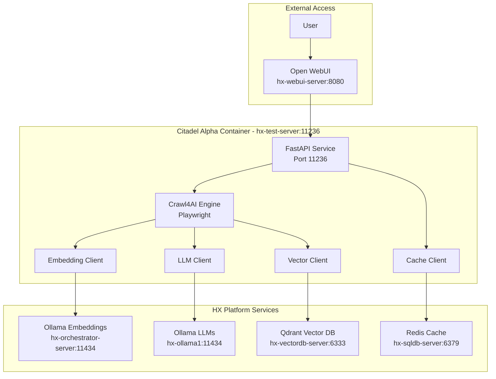

# Spec: Citadel Alpha HX Platform Integration

**Feature ID**: 002-citadel-alpha-integration
**Status**: Draft
**Created**: 2025-10-15
**Owner**: Hana-X AI Infrastructure Team

## Overview

Create Citadel Alpha container - a production-ready modification of Crawl4AI Agent that integrates with HX-Deployment and Test Platform services (Ollama, Qdrant, Redis, Open WebUI) instead of external APIs.

## User Scenarios

### Scenario 1: Deploy HX Platform Integrated Container
**As a** DevOps engineer
**I want to** deploy Citadel Alpha container with HX Platform service connections
**So that** I can leverage local infrastructure instead of external APIs

**Acceptance Criteria**:
- [ ] Container builds with HX Platform client libraries (ollama, qdrant-client, redis)
- [ ] FastAPI service is accessible at http://hx-test-server:11236
- [ ] Health check validates connectivity to all HX Platform services
- [ ] Pre-flight checks verify service availability before deployment

### Scenario 2: Web Crawling with Local LLM
**As a** user via Open WebUI
**I want to** crawl and process web content using Ollama LLMs
**So that** I can avoid external API costs and latency

**Acceptance Criteria**:
- [ ] Can submit crawl request via API endpoint
- [ ] Playwright crawls target URL successfully
- [ ] Content is processed with Ollama embeddings (hx-orchestrator-server:11434)
- [ ] LLM analysis uses Ollama models (hx-ollama1:11434)
- [ ] No calls to external APIs (OpenAI, etc.)

### Scenario 3: Vector Storage in Qdrant
**As a** developer
**I want to** store crawl embeddings in Qdrant vector database
**So that** I can perform similarity searches across all crawled content

**Acceptance Criteria**:
- [ ] Creates collection in Qdrant on first use
- [ ] Stores page embeddings with metadata (URL, timestamp, model)
- [ ] Supports similarity search queries
- [ ] Integrates with existing Qdrant collections if available

### Scenario 4: Open WebUI Integration
**As a** user
**I want to** interact with Citadel Alpha via Open WebUI chat interface
**So that** I can use a familiar UI instead of learning new tools

**Acceptance Criteria**:
- [ ] Citadel Alpha exposes OpenAI-compatible API at `/v1` endpoints
- [ ] Open WebUI can connect using base URL: http://hx-test-server:11236/v1
- [ ] Chat messages trigger crawl operations
- [ ] Responses include crawled content and LLM analysis

### Scenario 5: Redis Caching for Performance
**As a** system
**I want to** cache frequently accessed crawl results in Redis
**So that** I can reduce redundant crawls and improve response time

**Acceptance Criteria**:
- [ ] Checks Redis cache before initiating crawl
- [ ] Stores crawl results with configurable TTL (default 1 hour)
- [ ] Cache invalidation on explicit user request
- [ ] Cache hit/miss metrics in health endpoint

## Requirements

### Functional Requirements

**FR-001**: HX Platform Service Integration
- Connect to Ollama embeddings at hx-orchestrator-server:11434
  - Models: mxbai-embed-large, nomic-embed-text, all-minilm
- Connect to Ollama LLMs at hx-ollama1:11434
  - Models: gemma3:27b, gpt-oss:20b, mistral:7b
- Connect to Qdrant at hx-vectordb-server:6333
- Connect to Redis at hx-sqldb-server:6379

**FR-002**: API Service (FastAPI)
- RESTful API endpoints for crawl operations
- OpenAI-compatible `/v1` endpoints for Open WebUI
- Job status tracking for async operations
- Health and integration status endpoints

**FR-003**: Crawl Engine
- Playwright-based web crawling
- Content extraction and chunking
- Metadata extraction (title, description, links)
- Configurable crawl depth and timeout

**FR-004**: Embedding Generation
- Generate embeddings using Ollama (hx-orchestrator-server)
- Support multiple embedding models
- Batch processing for efficiency
- Error handling with fallback models

**FR-005**: Vector Storage
- Create/manage Qdrant collections
- Store embeddings with metadata
- Similarity search with configurable threshold
- Collection statistics and health

**FR-006**: LLM Processing
- Content summarization using Ollama LLMs
- Question answering with RAG
- Citation extraction from source chunks
- Model selection via API parameter

**FR-007**: Caching Strategy
- Redis cache for crawl results
- Configurable TTL (default 3600s)
- Cache key: hash(url + crawl_options)
- Manual cache invalidation endpoint

### Non-Functional Requirements

**NFR-001**: Performance
- Crawl latency: <30s for typical websites
- Embedding generation: <10s per page (batch processing)
- Query response: <5s with cache, <15s without
- Support 5 concurrent crawls

**NFR-002**: Reliability
- Health checks for all HX Platform services
- Circuit breaker pattern for service failures
- Graceful degradation (e.g., skip caching if Redis down)
- Automatic retry with exponential backoff

**NFR-003**: Scalability
- Horizontal scaling via docker-compose scale
- Stateless API design (state in Redis/Qdrant only)
- Connection pooling for database clients
- Async I/O for all external service calls

**NFR-004**: Security
- No secrets in environment variables (use .env files)
- API key authentication for Open WebUI
- HTTPS for Qdrant connections
- Input validation and sanitization

**NFR-005**: Observability
- Structured logging (JSON format)
- Health endpoint with service status
- Metrics endpoint (Prometheus format)
- Request tracing with correlation IDs

### Technical Requirements

**TR-001**: Modified Dependencies
```python
# REMOVED from original:
# openai==1.76.2        → Replaced with ollama
# chromadb==1.0.7       → Replaced with qdrant-client
# streamlit==1.45.0     → Replaced with fastapi

# ADDED for HX Platform:
ollama==0.4.8
qdrant-client==1.12.1
redis==5.2.1
fastapi==0.115.9
uvicorn[standard]==0.34.2
```

**TR-002**: Configuration Management
- Pydantic settings for environment variables
- Separate configs for each HX Platform service
- Validation on startup with clear error messages
- Support for .env file and environment variables

**TR-003**: Ansible Deployment
- Playbook: `ansible/playbooks/deploy-citadel-alpha.yml`
- Pre-flight: Verify HX Platform services reachable
- Docker network: Connect to `hx-platform` network
- Health validation with retries post-deployment

## Architecture



## Data Model

### Configuration Schema
```python
from pydantic import BaseModel, HttpUrl
from pydantic_settings import BaseSettings

class OllamaConfig(BaseSettings):
    embeddings_url: HttpUrl = "http://hx-orchestrator-server:11434"
    embeddings_model: str = "mxbai-embed-large"
    llm_url: HttpUrl = "http://hx-ollama1:11434"
    llm_model: str = "gemma3:27b"

class QdrantConfig(BaseSettings):
    url: HttpUrl = "https://hx-vectordb-server:6333"
    collection_name: str = "citadel_alpha_crawls"
    api_key: str | None = None

class RedisConfig(BaseSettings):
    url: str = "redis://hx-sqldb-server:6379"
    db: int = 0
    password: str | None = None

class HXPlatformConfig(BaseSettings):
    ollama: OllamaConfig
    qdrant: QdrantConfig
    redis: RedisConfig
```

### Qdrant Collection Schema
```python
{
    "name": "citadel_alpha_crawls",
    "vectors": {
        "size": 1024,  # mxbai-embed-large dimension
        "distance": "Cosine"
    },
    "payload_schema": {
        "url": "keyword",
        "title": "text",
        "content": "text",
        "crawled_at": "datetime",
        "model": "keyword",
        "chunk_index": "integer"
    }
}
```

### Redis Cache Schema
```python
# Key pattern: crawl:{url_hash}
# Value: JSON serialized CrawlResult
{
    "url": "string",
    "title": "string",
    "content": "string",
    "embeddings": [[float]],
    "metadata": {},
    "cached_at": "timestamp",
    "ttl": 3600
}
```

## API Contracts

### Health Endpoints

#### GET /health
```http
GET /health
Response: 200 OK
{
  "status": "healthy",
  "timestamp": "2025-10-15T10:30:00Z",
  "version": "1.0.0"
}
```

#### GET /health/integrations
```http
GET /health/integrations
Response: 200 OK
{
  "ollama_embeddings": {
    "status": "healthy",
    "url": "http://hx-orchestrator-server:11434",
    "latency_ms": 45,
    "models": ["mxbai-embed-large", "nomic-embed-text"]
  },
  "ollama_llm": {
    "status": "healthy",
    "url": "http://hx-ollama1:11434",
    "latency_ms": 52,
    "models": ["gemma3:27b", "gpt-oss:20b", "mistral:7b"]
  },
  "qdrant": {
    "status": "healthy",
    "url": "https://hx-vectordb-server:6333",
    "latency_ms": 23,
    "collections": 12
  },
  "redis": {
    "status": "healthy",
    "url": "redis://hx-sqldb-server:6379",
    "latency_ms": 8,
    "cache_hit_rate": 0.67
  }
}
```

### Crawl Endpoints

#### POST /api/crawl
```http
POST /api/crawl
Content-Type: application/json
{
  "url": "https://example.com",
  "max_depth": 1,
  "extract_embeddings": true,
  "llm_analysis": true,
  "use_cache": true
}

Response: 202 Accepted
{
  "job_id": "uuid",
  "status": "processing",
  "message": "Crawl job submitted"
}
```

#### GET /api/crawl/{job_id}
```http
GET /api/crawl/{job_id}
Response: 200 OK
{
  "job_id": "uuid",
  "status": "completed",
  "url": "https://example.com",
  "title": "Example Domain",
  "content": "...",
  "embeddings_count": 12,
  "llm_summary": "This website serves as an example...",
  "cached": false,
  "processing_time_ms": 8234
}
```

### Collection Endpoints

#### GET /api/collections
```http
GET /api/collections
Response: 200 OK
{
  "collections": [
    {
      "name": "citadel_alpha_crawls",
      "vectors_count": 1543,
      "indexed_vectors_count": 1543,
      "points_count": 128
    }
  ]
}
```

#### POST /api/collections
```http
POST /api/collections
Content-Type: application/json
{
  "name": "custom_collection",
  "vector_size": 1024,
  "distance": "Cosine"
}

Response: 201 Created
{
  "name": "custom_collection",
  "created": true
}
```

### Query Endpoints

#### POST /api/query
```http
POST /api/query
Content-Type: application/json
{
  "query": "What are the main features?",
  "collection": "citadel_alpha_crawls",
  "limit": 5,
  "threshold": 0.7,
  "include_llm_response": true
}

Response: 200 OK
{
  "results": [
    {
      "score": 0.89,
      "url": "https://example.com",
      "content": "...",
      "metadata": {...}
    }
  ],
  "llm_response": "Based on the crawled content, the main features are...",
  "sources": [
    {"url": "https://example.com", "relevance": 0.89}
  ]
}
```

### OpenAI-Compatible Endpoints (for Open WebUI)

#### POST /v1/chat/completions
```http
POST /v1/chat/completions
Content-Type: application/json
Authorization: Bearer {HX_API_KEY}
{
  "model": "citadel-alpha",
  "messages": [
    {"role": "user", "content": "Crawl https://example.com and summarize"}
  ]
}

Response: 200 OK
{
  "id": "chatcmpl-uuid",
  "object": "chat.completion",
  "model": "citadel-alpha",
  "choices": [
    {
      "message": {
        "role": "assistant",
        "content": "I've crawled the website. Summary: ..."
      },
      "finish_reason": "stop"
    }
  ]
}
```

## Test Plan

### Unit Tests
- [ ] Ollama client connection and model listing
- [ ] Qdrant client collection operations
- [ ] Redis cache get/set/invalidate
- [ ] Embedding generation with multiple models
- [ ] LLM query processing

### Integration Tests
- [ ] End-to-end crawl with Ollama embeddings
- [ ] Vector storage and similarity search in Qdrant
- [ ] Cache hit/miss scenarios with Redis
- [ ] OpenAI-compatible API with Open WebUI
- [ ] Service failure scenarios (circuit breaker)

### Deployment Tests
- [ ] Ansible pre-flight checks catch missing services
- [ ] Container connects to HX Platform network
- [ ] Health checks pass within 40s start period
- [ ] Playbook idempotency (no changes on second run)

### Performance Tests
- [ ] Concurrent crawl load (5 simultaneous)
- [ ] Embedding generation latency (<10s per page)
- [ ] Query response with cache (<5s)
- [ ] Query response without cache (<15s)

### Comparison Tests (vs Original Crawl4AI Agent)
- [ ] Crawl accuracy: Same content extracted
- [ ] Embedding quality: Similar vector distributions
- [ ] Query relevance: Comparable search results
- [ ] Performance: Within 20% of original latency

## Success Metrics

- **Deployment Success**: 100% on hx-test-server with HX Platform services running
- **Service Integration**: 100% health check pass rate for all HX Platform services
- **Crawl Success Rate**: >95% (same as original)
- **Query Accuracy**: >90% relevance based on manual validation
- **Cache Hit Rate**: >60% after warm-up period
- **API Uptime**: >99% over 24-hour test period

## Risks and Mitigations

| Risk | Likelihood | Impact | Mitigation |
|------|-----------|--------|------------|
| Ollama service unavailable | Medium | High | Circuit breaker with fast-fail; health check alerts |
| Qdrant connection timeout | Low | High | Connection pooling; retry with exponential backoff |
| Redis cache eviction | Medium | Low | LRU policy; graceful degradation (bypass cache) |
| Embedding model mismatch | Low | Medium | Validate model dimensions on startup; clear error messages |
| Open WebUI incompatibility | Low | Medium | Test with current Open WebUI version; maintain API compatibility |

## Dependencies

- **Infrastructure**: Docker installed on hx-test-server
- **HX Platform Services**:
  - Ollama Embeddings (hx-orchestrator-server:11434)
  - Ollama LLMs (hx-ollama1:11434)
  - Qdrant (hx-vectordb-server:6333)
  - Redis (hx-sqldb-server:6379)
- **Network**: hx-platform Docker network exists
- **Prerequisite**: Crawl4AI Agent validation (Spec 001) completed

## Out of Scope

- **Phase 1 (Current Spec)**:
  - Multi-tenant isolation
  - Advanced authentication (beyond API key)
  - Real-time streaming responses
  - Custom embedding models

- **Future Enhancements**:
  - LangGraph workflow integration
  - LightRAG knowledge graph construction
  - Prometheus metrics export
  - Grafana dashboards

## Timeline

- **Spec Review**: 1 day
- **Implementation**: 5 days
  - Day 1: Configuration management, HX Platform clients
  - Day 2: FastAPI API endpoints, health checks
  - Day 3: Crawl engine with Ollama integration
  - Day 4: Qdrant storage, Redis caching
  - Day 5: Open WebUI integration, testing
- **Testing**: 3 days
  - Day 1: Unit and integration tests
  - Day 2: Deployment and performance tests
  - Day 3: Comparison with original, bug fixes
- **Total**: 9 days

## References

- Original Implementation: `containers/crawl4ai-agent/`
- HX Platform Architecture: `/home/agent0/workspace/hx-citadel-ansible/docs/Delivery-Enhancements/HX-ARCHITECTURE.md`
- Ollama API: https://github.com/ollama/ollama/blob/main/docs/api.md
- Qdrant Client: https://qdrant.tech/documentation/quick-start/
- FastAPI: https://fastapi.tiangolo.com/
- Crawl4AI: https://github.com/unclecode/crawl4ai

## Approval

- [ ] Product Owner: ___________________ Date: ___________
- [ ] Tech Lead: _____________________ Date: ___________
- [ ] DevOps: _______________________ Date: ___________
